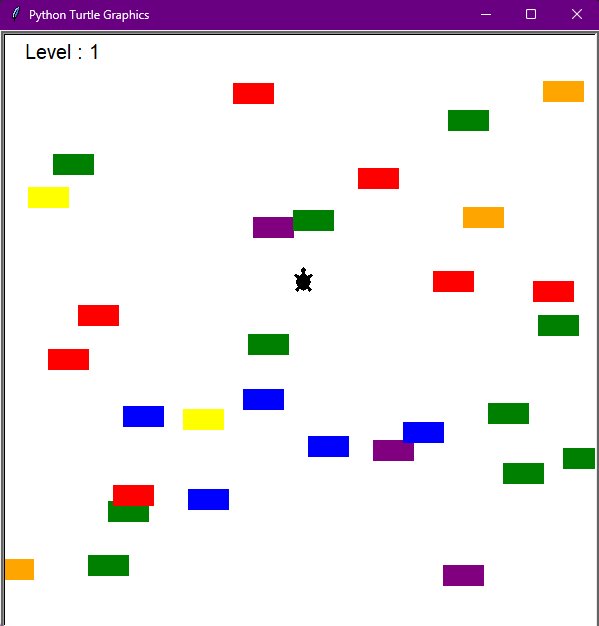

# Turtle Crossing Game
## Overview
Hello, everyone! I'm Mert, and today is Day 23 of my "100 Days of Python" challenge. For this project, I'm excited to introduce the "Turtle Crossing Game," a Python program using the Turtle graphics library. In this game, you'll guide a turtle to cross a busy road while avoiding cars.

## Project Description
In the "Turtle Crossing Game," you control a turtle at the bottom of the screen, trying to cross a busy road with moving cars. Your goal is to safely reach the top of the screen without colliding with any cars. The game becomes progressively challenging as the speed of the cars increases. Be careful and swift to navigate the road successfully!



## How to Run
To play the Turtle Crossing Game, run the following command:

```bash
python main.py
```

Ensure that you have Python installed on your system and all Python files (main.py, player.py, car_manager.py, scoreboard.py) are in the same folder.

## Project Files
* main.py: The main Python script for the Turtle Crossing Game.
* player.py: Defines the Player class for controlling the turtle.
* car_manager.py: Implements the CarManager class to manage cars on the road.
* scoreboard.py: Manages the scoring system and game over conditions.
  
## Getting Started
* Use the arrow key (Up) to control the turtle's movement.
* Safely guide the turtle across the road, avoiding collisions with cars.
* Each successful crossing earns points, and the game becomes more challenging over time.
## Educational Insights
This project provides hands-on experience with key Python concepts:

* Turtle Graphics: Utilizing the Turtle graphics library for interactive visual elements.
* Object-Oriented Programming: Implementing classes (Player, CarManager) to organize code and manage game entities.
* User Input Handling: Using keyboard input to control the turtle's movement.
* Collision Detection: Checking for collisions between the turtle and cars to determine success or failure.
* Game Logic: Implementing scoring, difficulty progression, and game over conditions.
## Customization
Feel free to customize the project by adjusting variables such as car speed, road width, or the scoring system. Experiment with different colors, speeds, or add new features to enhance your Turtle Crossing Game.

## Conclusion
I hope you enjoy playing the Turtle Crossing Game! It's been an exciting journey reaching Day 23, and I'm eager to continue exploring and learning. Have fun guiding the turtle across the busy road, and happy coding!
